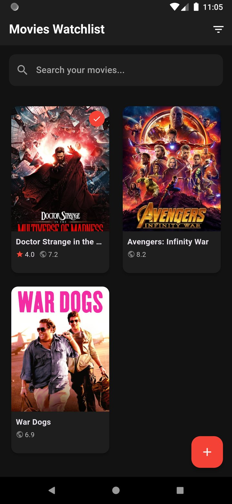
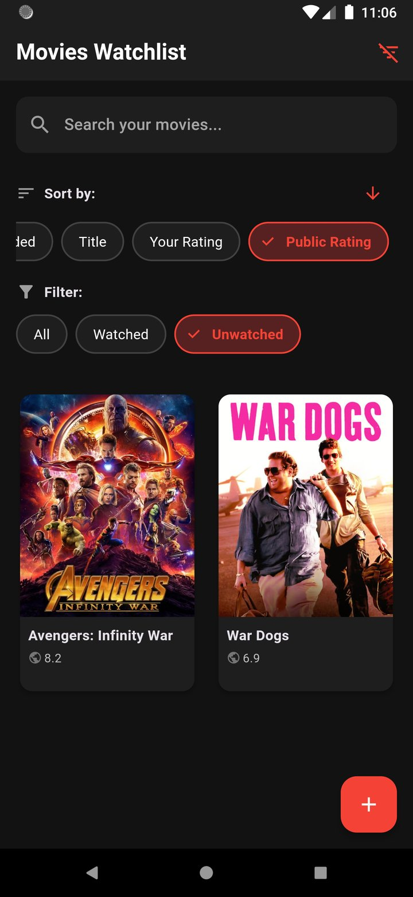
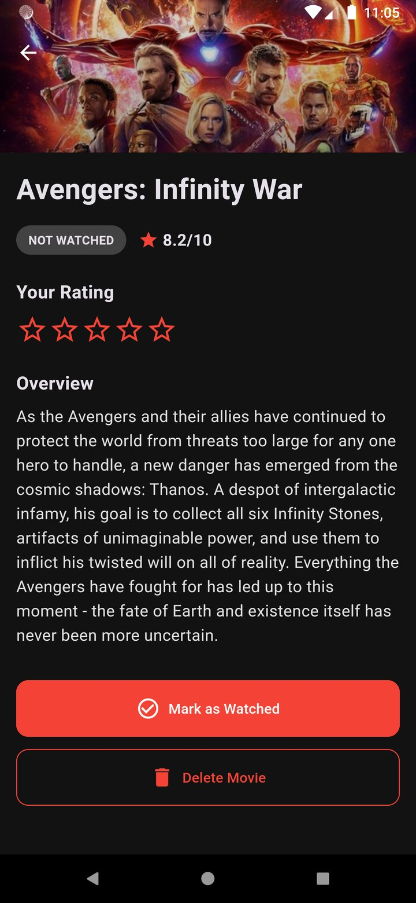
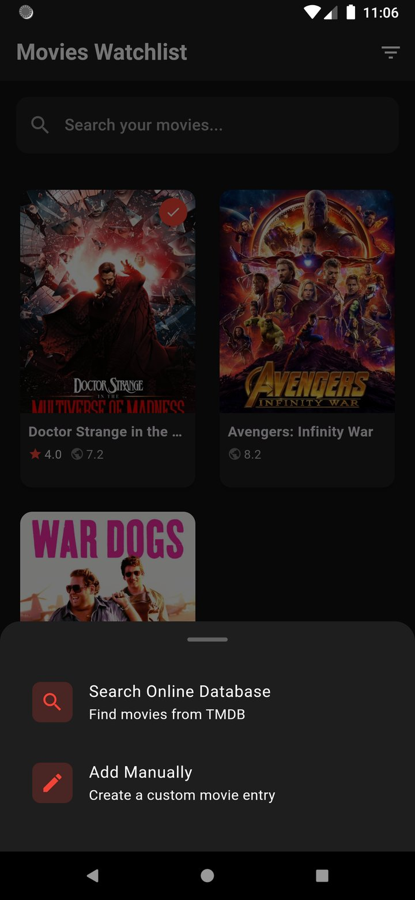
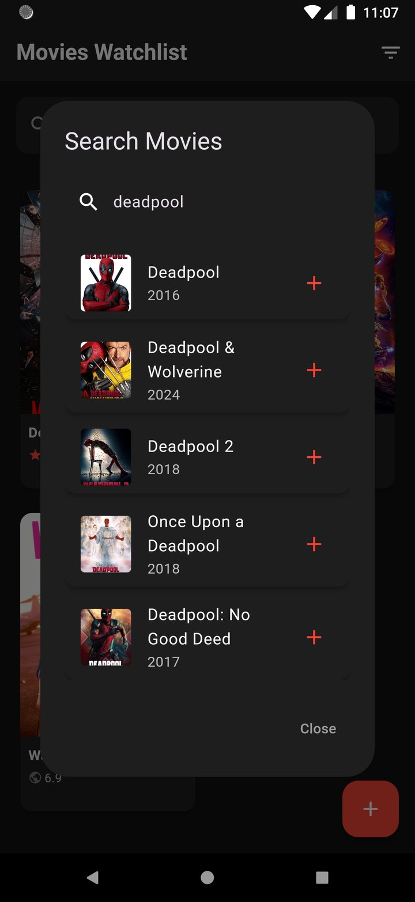

# Movies Watchlist

Your personal movie collection manager! Keep track of movies you want to watch, organize them by genre, and never forget about that film your friend recommended.

## What Can You Do?

### Browse Your Movies
View all your saved movies in one place. Each movie shows its poster, title, and rating at a glance.

### Filter and Sort
Easily find what you're looking for by filtering movies by genre or sorting them by rating, title, or year.

### View Movie Details
Tap on any movie to see the full details including the plot, cast, release date, and your personal rating.

### Add Movies Two Ways
Choose how you want to add movies to your watchlist:
- Search online for movies from a huge database
- Add them manually if you prefer

### Search Online Database
Find any movie by searching through thousands of titles. Just type the name and pick from the results!

## Features
- Save movies to your personal watchlist
- Search from a large online movie database
- Add custom ratings and notes
- Filter by genre
- Sort by title, rating, or year
- View detailed information about each movie
- Beautiful movie posters and images
